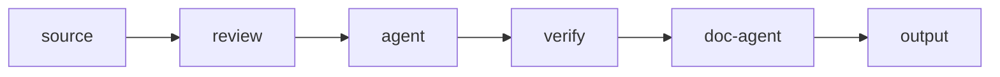

# Doc-Agent Mode — Axolotl Implementation Plan

**Status:** Done — Fully implemented  
- Backend: agentType field in NodeData + AgentNodeStrategy doc-agent path + PipelineFactory stage (7 files)
- Frontend: DocAgentBlock.vue (green document icon) + ThinkBlock.vue (code-agent) as separate block components + BlockConfigPanel agentType selector
- Pipeline template includes doc-agent after verifier stage

---

## Problem

Axolotl generates application code but never updates project documentation. The `.axolotl/` files remain as stale placeholders. EIOS development exposed this: emotions were broadened from 7→54, but `.axolotl/spec.md`, `plan.md`, `modules.md` all contain placeholder text.

## Solution

Add a **doc-agent mode** to the existing agent node type. When `agentType="doc-agent"`, the node reads stage outputs and existing project docs, then writes/updates `.md` files via `file_write`. Human approval via diff dialog (reuses `requireDiffReview` infrastructure with `.bak` + `AWAITING_DIFF_APPROVAL`).

## Design Decisions

| Question | Decision |
|----------|----------|
| Separate type or mode? | **Mode** of agent node (`agentType: "code-agent"` / `"doc-agent"`) |
| Pipeline position | **User places manually**. Default template: before output (or end if none) |
| Design doc creation | **Auto** — doc-agent decides when a feature needs a `design/` doc |
| spec.md updates | **Append**, never overwrite |
| plan.md | **Never touch** — reserved for future task planning |
| Human approval | **Yes** — `requireDiffApproval` reuses existing mechanism |
| Icon | **SVG** (document with pencil), no emoji |

## Files doc-agent updates

| File | Behaviour | Condition |
|------|-----------|-----------|
| `.axolotl/spec.md` | Append new feature sections | Always |
| `.axolotl/changelog.md` | Append session entry (`## YYYY-MM-DD — title`) | Always |
| `design/<feature-name>.md` | Create if feature >1 file changed | LLM decides |
| `review.md` | Replace content if review node ran | Only if review ran |
| `README.md` | Update only if core purpose changed | Rare |
| `.axolotl/plan.md` | Do NOT touch | Always |

## Backend changes

### `Node.java` — agentType in config

```java
// stored in node.getConfig() as Map<String,Object>
// key: "agentType", values: "code-agent" (default) | "doc-agent"
```

Default `"code-agent"` preserves all existing schemas.

### `AgentNodeStrategy.java` — conditional prompt + tools

- `buildSystemPrompt()` reads `agentType` from node config
- `"code-agent"` → existing code generation prompt
- `"doc-agent"` → documentation update prompt (see below)
- Default tools for doc-agent: `file_read`, `file_write`, `directory_read` (no `bash`, `grep`)
- `enabledTools` sync from stage config still applies (user can add tools)

### `PipelineService.java` — default pipeline template



## Frontend changes

### SVG icon

`frontend/src/assets/icons/doc-agent.svg` — document outline with pencil, monochrome.

### Types (`schema.ts`)

```ts
interface NodeData {
  agentType?: 'code-agent' | 'doc-agent'
}
```

### `BlockConfigPanel.vue`

Dropdown in Agent block config:
```
[Code Agent] [Doc Agent]
```
- Switches system prompt preview
- Hides bash/grep tool configs for doc-agent
- Changes label in blueprint

### Agent block component

- `"code-agent"` → existing appearance (robot/brain icon)
- `"doc-agent"` → SVG icon, tinted accent border

### DiffReview dialog

Already works for `.md` files. Verify on first run.

## Doc-agent system prompt (draft)

```
You are a documentation agent for project "{schemaName}".
Your task is to update project documentation based on recent changes.

## Tools
- file_read — read existing documentation files
- file_write — create or update files (creates .bak backups)
- directory_read — list files in a directory

## Documentation structure
- {targetPath}/.axolotl/spec.md — project specification (APPEND new features)
- {targetPath}/.axolotl/changelog.md — session changelog (APPEND entry)
- {targetPath}/design/ — feature design docs (CREATE for new features)
- {targetPath}/README.md — project overview (UPDATE only if core purpose changed)
- {targetPath}/review.md — review results (UPDATE if review data available)

## Rules
1. READ existing files BEFORE modifying — you must APPEND, not replace.
2. spec.md: add new features as new sections with ## heading. Preserve all existing content.
3. changelog.md: append entry in format:
   ## YYYY-MM-DD — <session title>
   - <change>
4. design/: create <feature-name>.md for each feature >1 file. Include: purpose, UI (ASCII),
   data model, API surface.
5. README: update only if the project's core purpose/description has changed.
6. review.md: replace content if review node provided findings.
7. Do NOT modify .axolotl/plan.md — reserved for future task planning.
8. After writing, output summary JSON:
   {"updatedDocs": ["path1.md"], "createdDocs": ["design/feature-x.md"]}
```

## Implementation order

1. `Node.java` — agentType in config
2. `AgentNodeStrategy.java` — conditional prompt + tools
3. SVG icon for doc-agent
4. `BlockConfigPanel.vue` — agent type selector
5. Agent block component — two visual modes
6. `PipelineService.java` — default pipeline with doc-agent
7. Test: EIOS pipeline, verify .md files created/updated
8. Test: re-run, verify append (no duplication)

## Edge cases

| Scenario | Behaviour |
|----------|-----------|
| First run (no .md files) | Doc-agent creates spec.md, changelog.md |
| Re-run | Append without duplicating existing content |
| Only doc-agent (no code-agent) | Works from review/verifier results |
| requireDiffApproval=false | Auto-write, no dialog |
| doc-agent + output node | Doc-agent before output, output writes pipeline-report.md |
| Weak model (7B) | May not generate tool_calls — fallback to stronger model |
| Multiple doc-agents | User responsibility — each gets same stage outputs |
