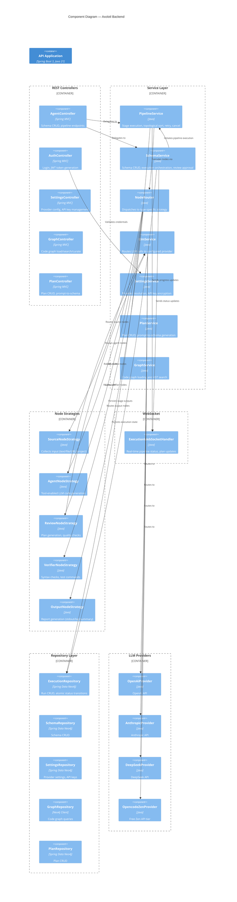

# C4 Component — Backend

```mermaid
C4Component
  title Component Diagram — Axolotl Backend

  Container(api, "API Application", "Spring Boot 3, Java 21")

  Container_Boundary(controllers, "REST Controllers") {
    Component(agentCtrl, "AgentController", "Spring MVC", "Schema CRUD, pipeline endpoints")
    Component(authCtrl, "AuthController", "Spring MVC", "Login, JWT token generation")
    Component(settingsCtrl, "SettingsController", "Spring MVC", "Provider config, API key management")
    Component(graphCtrl, "GraphController", "Spring MVC", "Code graph load/search/curate")
    Component(planCtrl, "PlanController", "Spring MVC", "Plan CRUD, prompt-to-schema")
  }

  Container_Boundary(services, "Service Layer") {
    Component(pipelineSvc, "PipelineService", "Java", "Stage execution, topological sort, retry, cancel")
    Component(schemaSvc, "SchemaService", "Java", "Schema CRUD, execution orchestration, review approval")
    Component(nodeRouter, "NodeRouter", "Java", "Dispatches to type-specific strategy")
    Component(llmSvc, "LlmService", "Java", "Routes LLM calls to configured provider")
    Component(settingsSvc, "SettingsService", "Java", "Provider resolution, API key encryption")
    Component(planSvc, "PlanService", "Java", "Plan CRUD, prompt-to-schema generation")
    Component(graphSvc, "GraphService", "Java", "Code graph loading and AST search")
  }

  Container_Boundary(strategies, "Node Strategies") {
    Component(sourceStrategy, "SourceNodeStrategy", "Java", "Collects input (text/file/URL/project)")
    Component(agentStrategy, "AgentNodeStrategy", "Java", "Tool-enabled LLM code generation")
    Component(reviewStrategy, "ReviewNodeStrategy", "Java", "Plan generation, quality checks")
    Component(verifierStrategy, "VerifierNodeStrategy", "Java", "Syntax checks, test commands")
    Component(outputStrategy, "OutputNodeStrategy", "Java", "Report generation (stdout/log/summary)")
  }

  Container_Boundary(ws, "WebSocket") {
    Component(wsHandler, "ExecutionWebSocketHandler", "Java", "Real-time pipeline status, plan updates")
  }

  Container_Boundary(repos, "Repository Layer") {
    Component(execRepo, "ExecutionRepository", "Spring Data Neo4j", "Run CRUD, atomic status transitions")
    Component(schemaRepo, "SchemaRepository", "Spring Data Neo4j", "Schema CRUD")
    Component(settingsRepo, "SettingsRepository", "Spring Data Neo4j", "Provider settings, API keys")
    Component(graphRepo, "GraphRepository", "Neo4j Client", "Code graph queries")
    Component(planRepo, "PlanRepository", "Spring Data Neo4j", "Plan CRUD")
  }

  Container_Boundary(providers, "LLM Providers") {
    Component(openai, "OpenAiProvider", "Java", "OpenAI API")
    Component(anthropic, "AnthropicProvider", "Java", "Anthropic API")
    Component(deepseek, "DeepSeekProvider", "Java", "DeepSeek API")
    Component(zendapi, "OpencodeZenProvider", "Java", "Free Zen API tier")
  }

  Rel(agentCtrl, schemaSvc, "Delegates to")
  Rel(agentCtrl, pipelineSvc, "Delegates to")
  Rel(authCtrl, settingsSvc, "Validates credentials")

  Rel(schemaSvc, pipelineSvc, "Initiates pipeline execution")
  Rel(schemaSvc, wsHandler, "Sends status updates")
  Rel(schemaSvc, execRepo, "Persists execution state")

  Rel(pipelineSvc, nodeRouter, "Executes nodes via")
  Rel(pipelineSvc, execRepo, "Persists stage outputs")
  Rel(pipelineSvc, wsHandler, "Sends progress updates")

  Rel(nodeRouter, sourceStrategy, "Routes source nodes")
  Rel(nodeRouter, agentStrategy, "Routes agent nodes")
  Rel(nodeRouter, reviewStrategy, "Routes review nodes")
  Rel(nodeRouter, verifierStrategy, "Routes verifier nodes")
  Rel(nodeRouter, outputStrategy, "Routes output nodes")

  Rel(agentStrategy, llmSvc, "Calls LLM")
  Rel(reviewStrategy, llmSvc, "Calls LLM")

  Rel(llmSvc, openai, "Routes to")
  Rel(llmSvc, anthropic, "Routes to")
  Rel(llmSvc, deepseek, "Routes to")
  Rel(llmSvc, zendapi, "Routes to")
```
