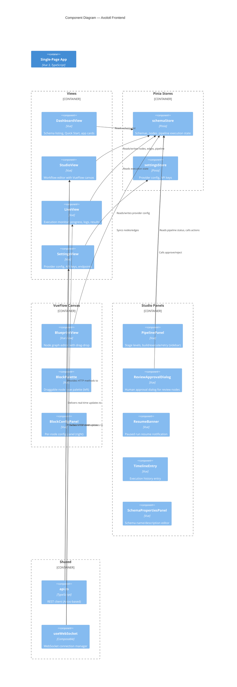

# C4 Component — Frontend

```mermaid
C4Component
  title Component Diagram — Axolotl Frontend

  Container(spa, "Single-Page App", "Vue 3, TypeScript")

  Container_Boundary(views, "Views") {
    Component(dashboard, "DashboardView", "Vue", "Schema listing, Quick Start, app cards")
    Component(studio, "StudioView", "Vue", "Workflow editor with VueFlow canvas")
    Component(live, "LiveView", "Vue", "Execution monitor: progress, logs, results")
    Component(settings, "SettingsView", "Vue", "Provider config, API keys, endpoints")
  }

  Container_Boundary(stores, "Pinia Stores") {
    Component(schemaStore, "schemaStore", "Pinia", "Schemas, nodes, pipeline execution state")
    Component(settingsStore, "settingsStore", "Pinia", "Provider config, API keys")
  }

  Container_Boundary(canvas, "VueFlow Canvas") {
    Component(blueprint, "BlueprintView", "Vue Flow", "Node graph editor with drag-drop")
    Component(blockPalette, "BlockPalette", "Vue", "Draggable node type palette (left)")
    Component(blockConfig, "BlockConfigPanel", "Vue", "Per-node config panel (right)")
  }

  Container_Boundary(panels, "Studio Panels") {
    Component(pipeline, "PipelinePanel", "Vue", "Stage levels, build/execute/retry (sidebar)")
    Component(review, "ReviewApprovalDialog", "Vue", "Human approval dialog for review nodes")
    Component(resume, "ResumeBanner", "Vue", "Paused run resume notification")
    Component(timeline, "TimelineEntry", "Vue", "Execution history entry")
    Component(schemaProps, "SchemaPropertiesPanel", "Vue", "Schema name/description editor")
  }

  Container_Boundary(shared, "Shared") {
    Component(api, "api.ts", "TypeScript", "REST client (Axios-based)")
    Component(ws, "useWebSocket", "Composable", "WebSocket connection manager")
  }

  Rel(dashboard, schemaStore, "Reads schema list")
  Rel(studio, schemaStore, "Reads/writes nodes, edges, pipeline")
  Rel(live, schemaStore, "Reads execution state")
  Rel(settings, settingsStore, "Reads/writes provider config")

  Rel(blueprint, schemaStore, "Syncs nodes/edges")
  Rel(pipeline, schemaStore, "Reads pipeline status, calls actions")
  Rel(review, schemaStore, "Calls approve/reject")

  Rel(api, studio, "Provides HTTP methods to")
  Rel(api, settings, "Provides HTTP methods to")
  Rel(ws, studio, "Delivers real-time updates to")
  Rel(ws, live, "Delivers real-time updates to")
```
