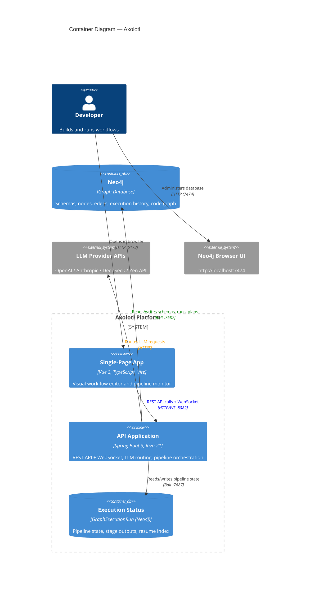

# C4 Container — Axolotl

```mermaid
C4Container
  title Container Diagram — Axolotl

  Person(developer, "Developer", "Builds and runs workflows")

  System_Boundary(axolotl, "Axolotl Platform") {
    Container(spa, "Single-Page App", "Vue 3, TypeScript, Vite", "Visual workflow editor and pipeline monitor")
    Container(api, "API Application", "Spring Boot 3, Java 21", "REST API + WebSocket, LLM routing, pipeline orchestration")
    ContainerDb(execDb, "Execution Status", "GraphExecutionRun (Neo4j)", "Pipeline state, stage outputs, resume index")
  }

  ContainerDb(neo4j, "Neo4j", "Graph Database", "Schemas, nodes, edges, execution history, code graph")
  System_Ext(llmApis, "LLM Provider APIs", "OpenAI / Anthropic / DeepSeek / Zen API")
  System_Ext(neo4jBrowser, "Neo4j Browser UI", "http://localhost:7474")

  Rel(developer, spa, "Opens in browser", "HTTP :5173")
  Rel(spa, api, "REST API calls + WebSocket", "HTTP/WS :8082")
  Rel(api, neo4j, "Reads/writes schemas, runs, plans", "Bolt :7687")
  Rel(api, execDb, "Reads/writes pipeline state", "Bolt :7687")
  Rel(api, llmApis, "Routes LLM requests", "HTTPS")
  Rel(developer, neo4jBrowser, "Administers database", "HTTP :7474")

  UpdateRelStyle(spa, api, $textColor="blue", $offsetY="-10")
  UpdateRelStyle(api, neo4j, $textColor="green", $offsetY="-10")
  UpdateRelStyle(api, llmApis, $textColor="orange", $offsetY="-20")
```

