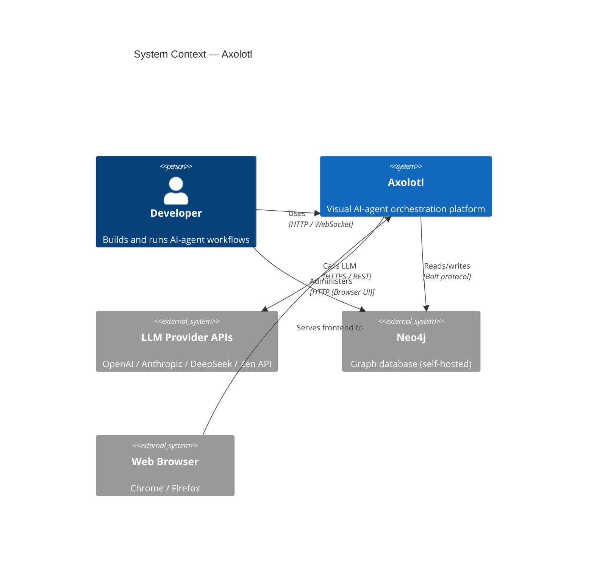

# C4 Context — Axolotl

```mermaid
C4Context
  title System Context — Axolotl

  Person(developer, "Developer", "Builds and runs AI-agent workflows")

  System(axolotl, "Axolotl", "Visual AI-agent orchestration platform")

  System_Ext(providers, "LLM Provider APIs", "OpenAI / Anthropic / DeepSeek / Zen API")
  System_Ext(neo4j, "Neo4j", "Graph database (self-hosted)")
  System_Ext(browser, "Web Browser", "Chrome / Firefox")

  Rel(developer, axolotl, "Uses", "HTTP / WebSocket")
  Rel(axolotl, providers, "Calls LLM", "HTTPS / REST")
  Rel(axolotl, neo4j, "Reads/writes", "Bolt protocol")
  Rel(browser, axolotl, "Serves frontend to")
  Rel(developer, neo4j, "Administers", "HTTP (Browser UI)")
```

