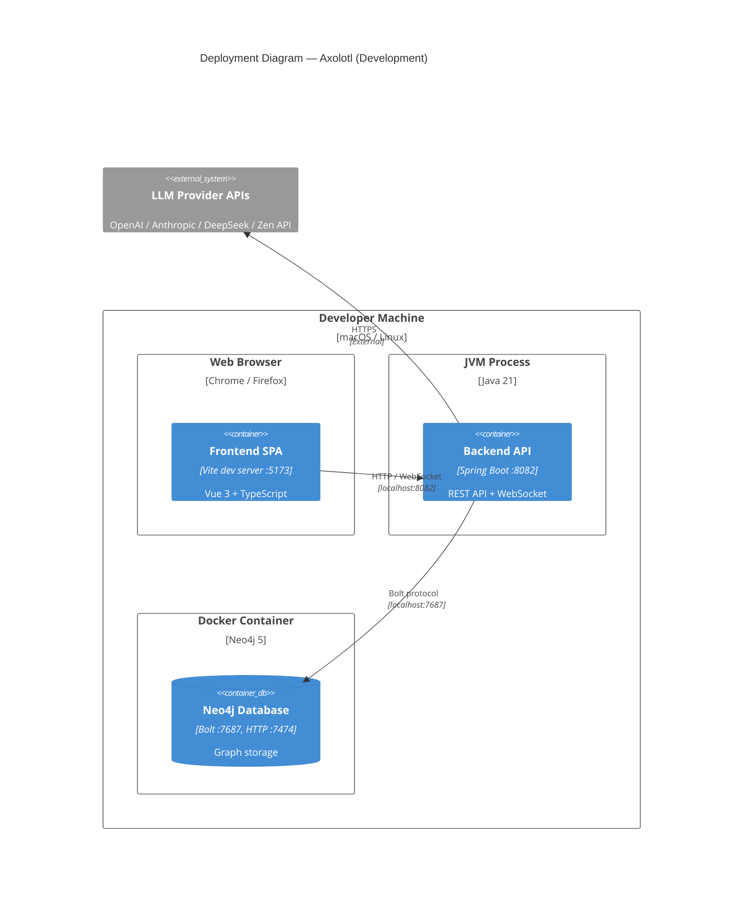

# C4 Deployment — Axolotl Development

```mermaid
C4Deployment
  title Deployment Diagram — Axolotl (Development)

  Deployment_Node(devPc, "Developer Machine", "macOS / Linux") {
    Deployment_Node(browser, "Web Browser", "Chrome / Firefox") {
      Container(spa, "Frontend SPA", "Vite dev server :5173", "Vue 3 + TypeScript")
    }
    Deployment_Node(jvm, "JVM Process", "Java 21") {
      Container(api, "Backend API", "Spring Boot :8082", "REST API + WebSocket")
    }
    Deployment_Node(docker, "Docker Container", "Neo4j 5") {
      ContainerDb(neo4j, "Neo4j Database", "Bolt :7687, HTTP :7474", "Graph storage")
    }
  }

  System_Ext(llmApis, "LLM Provider APIs", "OpenAI / Anthropic / DeepSeek / Zen API")

  Rel(spa, api, "HTTP / WebSocket", "localhost:8082")
  Rel(api, neo4j, "Bolt protocol", "localhost:7687")
  Rel(api, llmApis, "HTTPS", "External")
```
