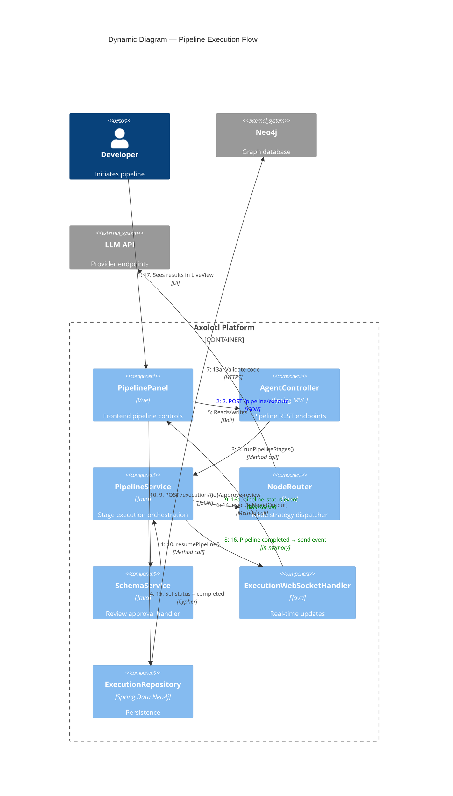

# C4 Dynamic — Pipeline Execution

```mermaid
C4Dynamic
  title Dynamic Diagram — Pipeline Execution Flow

  Person(developer, "Developer", "Initiates pipeline")

  Container_Boundary(axolotl, "Axolotl Platform") {
    Component(spa, "PipelinePanel", "Vue", "Frontend pipeline controls")
    Component(ctrl, "AgentController", "Spring MVC", "Pipeline REST endpoints")
    Component(pipelineSvc, "PipelineService", "Java", "Stage execution orchestration")
    Component(nodeRouter, "NodeRouter", "Java", "Node strategy dispatcher")
    Component(schemaSvc, "SchemaService", "Java", "Review approval handler")
    Component(ws, "ExecutionWebSocketHandler", "Java", "Real-time updates")
    Component(repo, "ExecutionRepository", "Spring Data Neo4j", "Persistence")
  }

  System_Ext(neo4j, "Neo4j", "Graph database")
  System_Ext(llm, "LLM API", "Provider endpoints")

  Rel(developer, spa, "1. Clicks Execute", "HTTP POST")
  Rel(spa, ctrl, "2. POST /pipeline/execute", "JSON")
  Rel(ctrl, pipelineSvc, "3. runPipelineStages()", "Method call")

  Rel(pipelineSvc, repo, "4. Create ExecutionRun status=running", "Cypher")
  Rel(repo, neo4j, "Persists", "Bolt")

  Rel(pipelineSvc, nodeRouter, "5. executeNode(Receive)", "Method call")
  Rel(nodeRouter, llm, "5a. (optional) LLM call", "HTTPS")
  Rel(pipelineSvc, ws, "5b. Stage completed → send update", "In-memory")

  Rel(pipelineSvc, nodeRouter, "6. executeNode(Review)", "Method call")
  Rel(nodeRouter, llm, "6a. Generate plan", "HTTPS")
  Rel(pipelineSvc, ws, "6b. Review plan → send update", "In-memory")
  Rel(pipelineSvc, repo, "6c. Save resumeIndex + AWAITING_APPROVAL status", "Cypher")
  Rel(repo, neo4j, "Persists", "Bolt")

  Rel(ws, spa, "6d. review_awaiting_approval event", "WebSocket")
  Rel(developer, spa, "7. Opens ReviewApprovalDialog", "UI")
  Rel(developer, spa, "8. Clicks Approve", "UI")

  Rel(spa, schemaSvc, "9. POST /execution/{id}/approve-review", "JSON")
  Rel(schemaSvc, pipelineSvc, "10. resumePipeline()", "Method call")
  Rel(pipelineSvc, repo, "11. Claim paused run, restore state", "Cypher")
  Rel(repo, neo4j, "Reads/writes", "Bolt")

  Rel(pipelineSvc, nodeRouter, "12. executeNode(Agent)", "Method call")
  Rel(nodeRouter, llm, "12a. Generate code", "HTTPS")

  Rel(pipelineSvc, nodeRouter, "13. executeNode(Verifier)", "Method call")
  Rel(nodeRouter, llm, "13a. Validate code", "HTTPS")

  Rel(pipelineSvc, nodeRouter, "14. executeNode(Output)", "Method call")
  Rel(pipelineSvc, repo, "15. Set status = completed", "Cypher")
  Rel(pipelineSvc, ws, "16. Pipeline completed → send event", "In-memory")
  Rel(ws, spa, "16a. pipeline_status event", "WebSocket")

  Rel(developer, spa, "17. Sees results in LiveView", "UI")

  UpdateRelStyle(spa, ctrl, $textColor="blue", $offsetY="-10")
  UpdateRelStyle(pipelineSvc, ws, $textColor="green", $offsetY="-10")
  UpdateRelStyle(ws, spa, $textColor="green", $offsetY="10")
```

