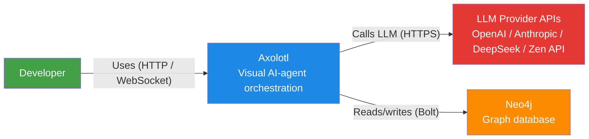

# Architecture

## Overview

Axolotl is a visual AI-agent orchestration platform. Users build workflows as node graphs in a visual canvas (Vue Flow), then execute them through a multi-stage pipeline system.

<!-- System Context Diagram -->
See [C4 Context diagram](/architecture/c4-context) for the full system context.



## Backend

### Stack
- **Spring Boot 3.x** with Java 21
- **Spring Data Neo4j 6** (SDN 6) for graph persistence
- **Virtual threads** (`Executors.newVirtualThreadPerTaskExecutor`) for concurrent node execution
- **WebSocket** (`ExecutionWebSocketHandler`) for real-time progress updates

### Key Services

| Service | Responsibility |
|---------|---------------|
| `SchemaService` | Schema CRUD, execution orchestration, history |
| `PipelineService` | Multi-stage pipeline execution, topological sort, retry |
| `NodeRouter` | Dispatches node execution to type-specific strategies |
| `LlmService` | Routes LLM calls to configured provider |
| `ExecutionRepository` | Persists execution runs, node results, stage outputs |
| `SettingsService` | Provider config, API key management |

### Node Strategies

Each node type has a dedicated strategy class:

| Strategy | Node Type |
|----------|-----------|
| `SourceNodeStrategy` | Receive — collects input (text, file, URL, project dir) |
| `AgentNodeStrategy` | Agent — tool-enabled LLM with write/read/bash tools |
| `ReviewNodeStrategy` | Review — plan generation + premortem/prism/postmortem checks |
| `VerifierNodeStrategy` | Verifier — syntax checks, test commands, quality gates |
| `OutputNodeStrategy` | Output — stdout, log, summary report |

## Frontend

### Stack
- **Vue 3** with Composition API (`<script setup lang="ts">`)
- **Vite** for dev/build
- **Vue Flow** for node graph canvas
- **Pinia** for state management (`schemaStore`, `settingsStore`)
- **Vitest** + **Playwright** for testing

### Key Views

| View | Purpose |
|------|---------|
| `DashboardView` | Schema listing, Quick Start, app cards |
| `StudioView` | Main editor — canvas, config panel, pipeline sidebar |
| `LiveView` | Execution monitor — progress, logs, results |
| `SettingsView` | Provider config, API keys, custom endpoints |

### Key Components

| Component | Purpose |
|-----------|---------|
| `BlueprintView` | Vue Flow canvas — drag-drop node graph |
| `BlockConfigPanel` | Per-node configuration panel (right sidebar) |
| `PipelinePanel` | Pipeline sidebar — stage levels, build/execute/retry |
| `ReviewApprovalDialog` | Human approval dialog for review nodes |
| `BlockPalette` | Draggable node palette (left sidebar) |

## Database (Neo4j)

All data is stored in Neo4j as labeled nodes and relationships.

### Key Node Labels

| Label | Purpose |
|-------|---------|
| `WorkflowSchema` | User-defined workflows (nodes + edges) |
| `ExecutionRun` | Per-execution state (status, stage progress) |
| `ExecutionRecord` | Execution history (completed runs) |
| `NodeExecution` | Per-node execution results |
| `GraphRecord` | Code graph (AST nodes, class hierarchy) |
| `Plan` | Development plan with task tracking |
| `PlanTask` | Individual tasks in a plan |

### Graph Features

Axolotl includes a **code graph** feature that loads Java/Axolotl source code into Neo4j as AST nodes. This enables semantic search, class lookup by stable hash, and context-aware code curation for AI agents.

Endpoints: `POST /api/graph/load`, `GET /api/graph/class/{hash}`, `POST /api/graph/search/ast`, `POST /api/graph/curate`.

## Pipeline System

See [Pipeline System](/en/pipeline) for detailed documentation.

The pipeline orchestrates multi-stage execution:

```
Receive ──▶ Review ──▶ Agent ──▶ Verify ──▶ Output
```

Each stage has dependency ordering via topological sort. Stages at the same dependency level execute in parallel. Review nodes pause the pipeline for human approval.

## Detailed C4 Diagrams

Full C4 model diagrams in `docs/architecture/`:

| Diagram | File | Shows |
|---------|------|-------|
| System Context | [c4-context.md](/architecture/c4-context) | System + external actors |
| Containers | [c4-containers.md](/architecture/c4-containers) | SPA, API, Neo4j, providers |
| Frontend Components | [c4-components-frontend.md](/architecture/c4-components-frontend) | Views, stores, panels |
| Backend Components | [c4-components-backend.md](/architecture/c4-components-backend) | Services, strategies, repositories |
| Pipeline Execution | [c4-dynamic-execution.md](/architecture/c4-dynamic-execution) | End-to-end execution flow |
| Deployment | [c4-deployment.md](/architecture/c4-deployment) | Dev deployment topology |
