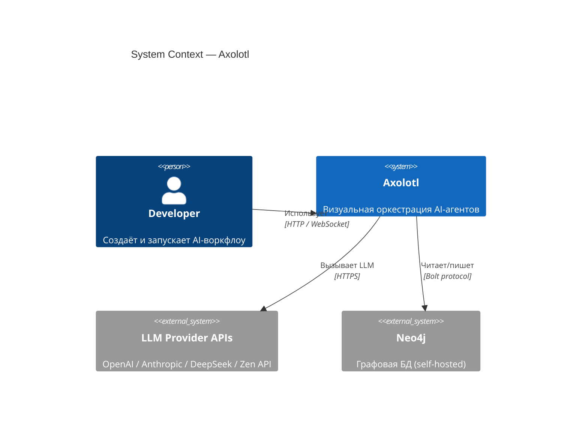

# Архитектура

## Обзор

Axolotl — это платформа визуальной оркестрации AI-агентов. Пользователи строят рабочие процессы в виде графа узлов на визуальном холсте (Vue Flow) и выполняют их через многозвенный пайплайн.

<!-- System Context Diagram -->
См. [C4 Context diagram](/architecture/c4-context) для полного контекста системы.



## Бэкенд

### Стек
- **Spring Boot 3.x** с Java 21
- **Spring Data Neo4j 6** (SDN 6) для хранения в графовой БД
- **Virtual threads** (`Executors.newVirtualThreadPerTaskExecutor`) для конкурентного выполнения узлов
- **WebSocket** (`ExecutionWebSocketHandler`) для обновлений в реальном времени

### Ключевые сервисы

| Сервис | Ответственность |
|--------|----------------|
| `SchemaService` | CRUD схем, оркестрация выполнения, история |
| `PipelineService` | Исполнение многозвенного пайплайна, топологическая сортировка, retry |
| `NodeRouter` | Диспетчеризация выполнения к стратегиям по типу узла |
| `LlmService` | Маршрутизация LLM-вызовов к настроенному провайдеру |
| `ExecutionRepository` | Персистентность запусков, результатов узлов, выводов этапов |
| `SettingsService` | Конфигурация провайдеров, управление API-ключами |

### Стратегии узлов

Каждый тип узла имеет выделенную стратегию:

| Стратегия | Тип узла |
|-----------|----------|
| `SourceNodeStrategy` | Receive — сбор ввода (текст, файл, URL, директория проекта) |
| `AgentNodeStrategy` | Agent — LLM с инструментами (write/read/bash) |
| `ReviewNodeStrategy` | Review — генерация плана + проверки premortem/prism/postmortem |
| `VerifierNodeStrategy` | Verifier — синтаксические проверки, тестовые команды |
| `OutputNodeStrategy` | Output — stdout, log, сводный отчёт |

## Фронтенд

### Стек
- **Vue 3** с Composition API (`<script setup lang="ts">`)
- **Vite** для разработки и сборки
- **Vue Flow** для графа узлов
- **Pinia** для управления состоянием (`schemaStore`, `settingsStore`)
- **Vitest** + **Playwright** для тестирования

### Ключевые View

| View | Назначение |
|------|-----------|
| `DashboardView` | Список схем, Quick Start, карточки приложений |
| `StudioView` | Основной редактор — холст, панель конфигурации, пайплайн |
| `LiveView` | Мониторинг выполнения — прогресс, логи, результаты |
| `SettingsView` | Конфигурация провайдеров, API-ключи, кастомные эндпоинты |

### Ключевые компоненты

| Компонент | Назначение |
|-----------|-----------|
| `BlueprintView` | Vue Flow холст — граф узлов drag-and-drop |
| `BlockConfigPanel` | Панель конфигурации узла (правая панель) |
| `PipelinePanel` | Панель пайплайна — этапы, build/execute/retry |
| `ReviewApprovalDialog` | Диалог утверждения для review-узлов |
| `BlockPalette` | Палитра блоков (левая панель) |

## База данных (Neo4j)

Все данные хранятся в Neo4j как размеченные узлы и связи.

### Ключевые метки узлов

| Метка | Назначение |
|-------|-----------|
| `WorkflowSchema` | Пользовательские схемы (узлы + связи) |
| `ExecutionRun` | Состояние выполнения (статус, прогресс этапов) |
| `ExecutionRecord` | История выполнений (завершённые запуски) |
| `NodeExecution` | Результаты выполнения узлов |
| `GraphRecord` | Граф кода (AST-узлы, иерархия классов) |
| `Plan` | План разработки с отслеживанием задач |
| `PlanTask` | Отдельные задачи в плане |

### Графовые возможности

Axolotl включает функцию **графа кода**, загружающую исходный код в Neo4j как AST-узлы. Это позволяет семантический поиск, поиск класса по стабильному хешу, и контекстную курацию для AI-агентов.

Эндпоинты: `POST /api/graph/load`, `GET /api/graph/class/{hash}`, `POST /api/graph/search/ast`, `POST /api/graph/curate`.

## Pipeline System

См. [Pipeline System](/ru/pipeline) для детальной документации.

Пайплайн оркестрирует многоэтапное выполнение:

```
Receive ──▶ Review ──▶ Agent ──▶ Verify ──▶ Output
```

Каждый этап имеет упорядочение зависимостей через топологическую сортировку. Этапы одного уровня зависимостей выполняются параллельно. Review-узлы приостанавливают пайплайн для утверждения человеком.

## Детальные C4 диаграммы

Полные C4 диаграммы в `docs/architecture/`:

| Диаграмма | Файл | Показывает |
|-----------|------|------------|
| System Context | [c4-context.md](/architecture/c4-context) | Система + внешние акторы |
| Containers | [c4-containers.md](/architecture/c4-containers) | SPA, API, Neo4j, провайдеры |
| Frontend Components | [c4-components-frontend.md](/architecture/c4-components-frontend) | View, store, панели |
| Backend Components | [c4-components-backend.md](/architecture/c4-components-backend) | Сервисы, стратегии, репозитории |
| Pipeline Execution | [c4-dynamic-execution.md](/architecture/c4-dynamic-execution) | Полный поток выполнения |
| Deployment | [c4-deployment.md](/architecture/c4-deployment) | Топология разработки |
